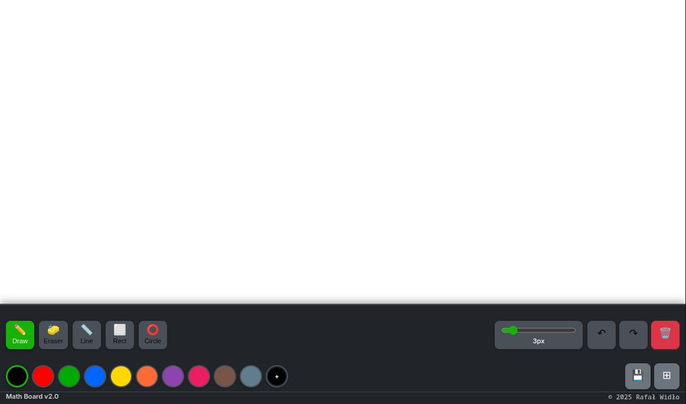

# Math Board

A modern, feature-rich digital whiteboard designed specifically for mathematical education and drawing.



## Features

### Drawing Tools
- **Free Drawing**: Natural pen/pencil drawing experience
- **Geometric Shapes**: Lines, rectangles, and circles with real-time preview
- **Color Palette**: 10 colors + custom picker
- **Brush Size Control**: Adjustable thickness (1-20px)
- **Grid Overlay**: Toggle-able for precise drawings

### Interface
- **Responsive Design**: Desktop, tablet, and mobile
- **Dark Mode**: Automatic system preference detection
- **Keyboard Navigation**: Full keyboard shortcuts
- **Touch Optimized**: Mobile gesture support

### Advanced Features
- **Undo/Redo**: 50-step history
- **Save**: Export PNG with timestamps
- **Keyboard Shortcuts**
- **Real-time Preview**: See shapes before committing
- **Performance Optimized**: Smooth on lower-end devices

## Quick Start

Open `index.html` in any modern web browser. No build process required.

For live development:
```bash
python3 -m http.server 8000
npx serve .
# or
php -S localhost:8000
```

## Keyboard Shortcuts

| Key | Action |
|-----|--------|
| D | Draw mode |
| L | Line tool |
| R | Rectangle tool |
| C | Circle tool |
| G | Toggle grid |
| Ctrl+Z | Undo |
| Ctrl+Y | Redo |
| Ctrl+S | Save as PNG |
| Ctrl+C | Clear canvas |

## Technical Details

**Built with:**
- p5.js v2.2.3 (loaded via CDN)
- Modern JavaScript (ES6+)
- CSS Grid & Flexbox
- Semantic HTML5, ARIA accessibility

**Browser Support:** Chrome 90+, Firefox 88+, Safari 14+, Edge 90+

**Architecture:**
- `index.html` - UI structure and styling
- `sketch.js` - Main application logic (MathBoard class)
- `p5.js` - Graphics library loaded via CDN

## Author

[Rafał Widło](https://github.com/septicwolf818)
